Report for Assignment 1 Members:

Abhigya Anand Vinesh Bonagiri

1\)

Name: LumiBot

URL: [<u>Lumiwealth/lumibot: Backtesting and Trading Bots Made Easy for
Crypto, Stocks, Options,</u>](https://github.com/Lumiwealth/lumibot)
[<u>Futures, FOREX and more
(github.com)</u>](https://github.com/Lumiwealth/lumibot)

Number of lines of code and the tool used to count it: 357,561

Programming language: python

2\) Coverage measurement

\<Inform the name of the existing tool that was executed and how it was
executed\>

We use Coverage.py. Following 3 commands were used coverage run;
coverage report; and coverage html

\<Show the coverage results provided by the existing tool with a
screenshot\>

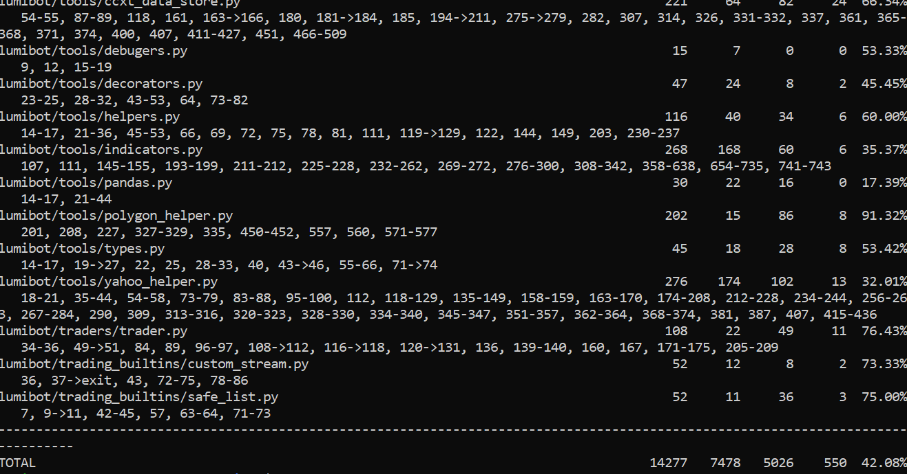

3

Our own coverage tool

\<The following is supposed to be repeated for each group member\>

\<Group member name\> Ishaan Iyer

Function 1 name
defcheck_positive(input,type,custom_message="",strict=False):

Show a patch (diff) or a link to a commit made in your forked repository
that shows the instrumented code to gather coverage measurements

[<u>Update types.py to analyse checkquantity and checkpositive ·
lobster-1/lumibotSEP@4222cdd
(github.com)</u>](https://github.com/lobster-1/lumibotSEP/commit/4222cdd1edda7437e7f7c4922a01a1ffc6c547b3)

> 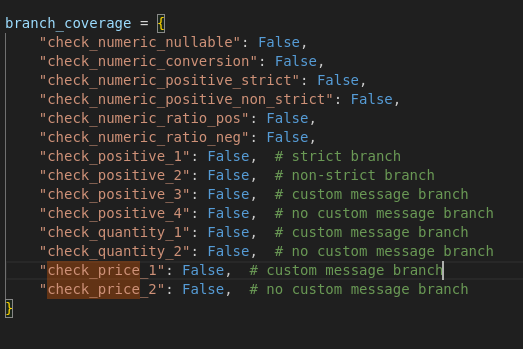 style="width:3.63194in;height:2.42361in" />Provide a screenshot of the
> coverage results output by the instrumentation

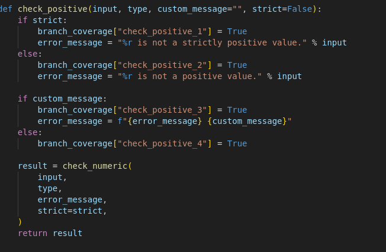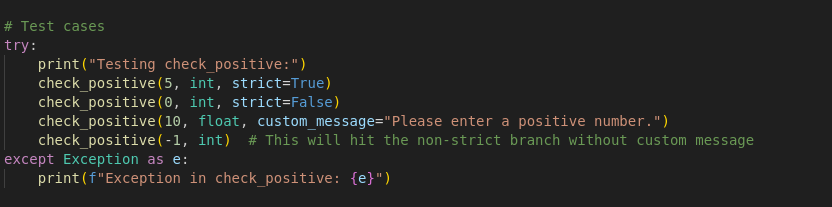

Thefunctionwascalled
withdifferentparameterstomakesureallofthebranchesarehit.
Ifweonlycallitonceonlysomeofthe brancheswillbehit

Function 2 name: check_price(price, custom_message="", nullable=True):

Show a patch (diff) or a link to a commit made in your forked repository
that shows the instrumented code to gather coverage measurements

[<u>Update types.py hidden branches added (else) ·
lobster-1/lumibotSEP@8250d37
(github.com)</u>](https://github.com/lobster-1/lumibotSEP/commit/8250d378d0b7c39be5ddef5062ce901f4d172ac7)

> Provide a screenshot of the coverage results output by the
> instrumentation

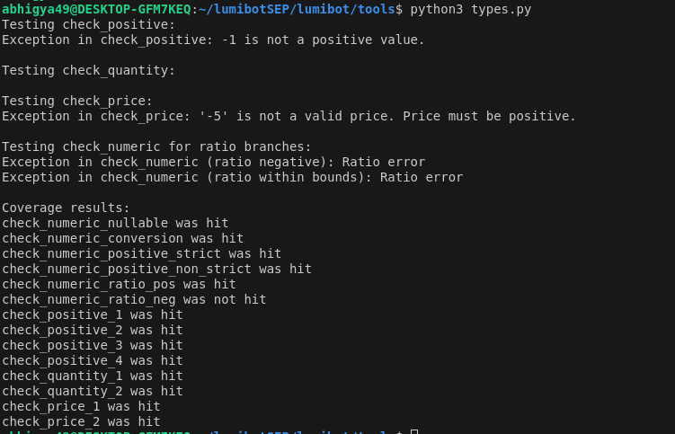

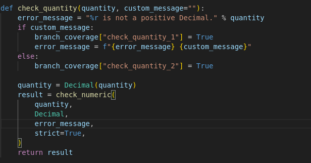

Thefunctionwascalled
withdifferentparameterstomakesureallofthebranchesarehit.
Ifweonlycallitonceonlysomeofthebrancheswillbehit

Member name: IshaanIyer

Function1name

Check_numerical()

Commit:

[<u>Updatetypes.pyadded analysesfor check_numericaland
check_price·lobster-1/lumibotSEP@6ab6eb8(github.com)</u>](https://github.com/lobster-1/lumibotSEP/commit/6ab6eb8f2b603a7cd285e8039074d5df608a702c)

Screenshot:

Function2

Check_price()

Commit:[<u>Updatetypes.pyadded analysesfor check_numericaland
check_price·lobster-1/lumibotSEP@6ab6eb8(github.com)</u>](https://github.com/lobster-1/lumibotSEP/commit/6ab6eb8f2b603a7cd285e8039074d5df608a702c)

Notethatallthe4functionswereinlumibot/tools/types.pysohavethesameimagefor
branchanalysis

4)Coverage improvement

Group member name: Abhigya Anand

> Test 1 Check_quantity()

Show a patch (diff) or a link to a commit made in your forked repository
that shows the new/enhanced test

> [<u>Create test_numerical_check,py · lobster-1/lumibotSEP@857126c
> (github.com)</u>](https://github.com/lobster-1/lumibotSEP/commit/857126cbb0c37c533571549cd0334375452f4f9c)

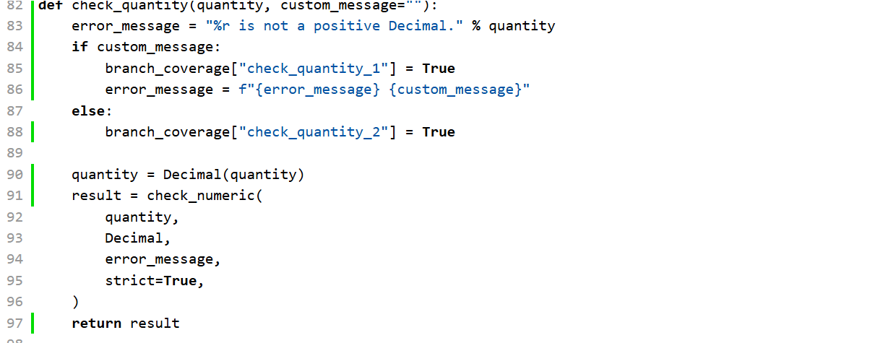

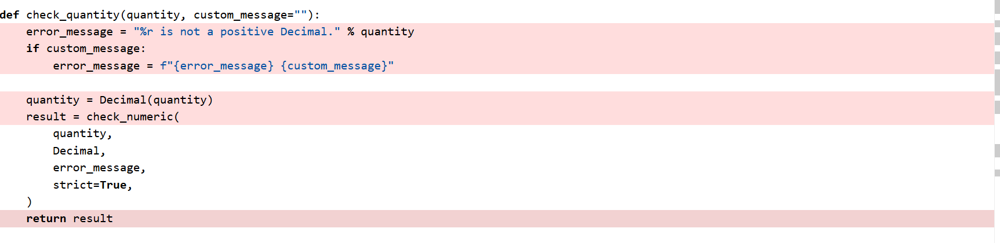Provide
a screenshot of the old coverage results (the same as you already showed
above):

> Provide a screenshot of the new coverage results

State the coverage improvement with a number and elaborate on why the
coverage is improved: As we can see in the old coverage html report the
lines in the red indicate the uncovered statements. By adding the new
tests we were able to cover all the statements/branches of the function
and also the hidden else branch. Since none of the branches were fully
covered earlier, the improvement is of 100%

> Test 2 Check_positive()

Show a patch (diff) or a link to a commit made in your forked repository
that shows the new/enhanced test

> [<u>https://github.com/lobster-1/lumibotSEP/commit/857126cbb0c37c533571549cd0334375452f4f9c</u>](https://github.com/lobster-1/lumibotSEP/commit/857126cbb0c37c533571549cd0334375452f4f9c)
>
> Provide a screenshot of the old coverage results

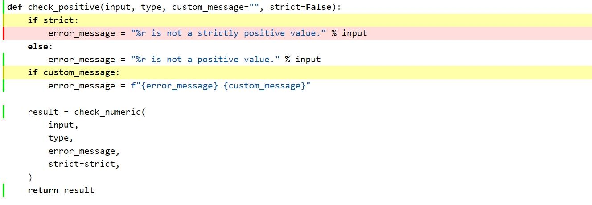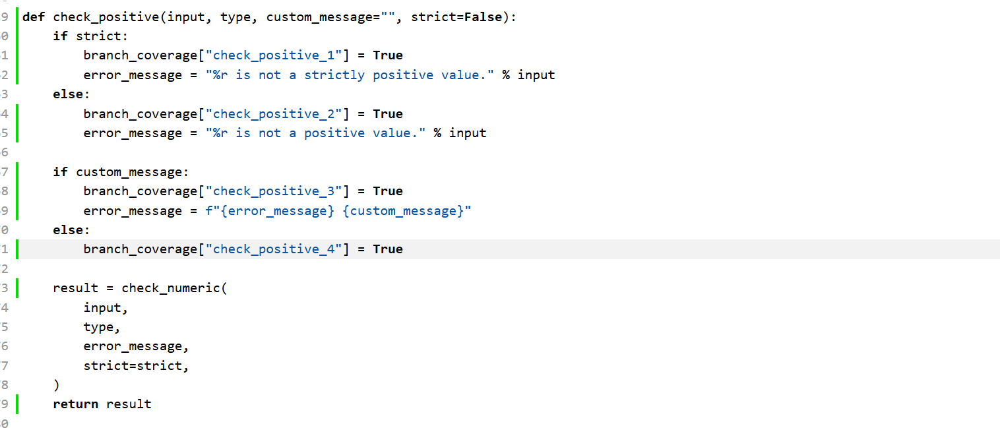

Screenshotofthenewcoverageresults:

Improvement:

Outofthe4branchesincheck_positive(includingthehiddenelse) only2ofthem
are covered byoriginaltests.Byaddingour testwewereabletocover
allthe4branches.

Totalbranchcoverageforthatfunctionnowis100%and improvementis2x(from2to4)

Group member:IshaanIyer

Testfor check_price

Commit:[<u>https://github.com/lobster-1/lumibotSEP/commit/857126cbb0c37c533571549cd0334375452f4f9c</u>](https://github.com/lobster-1/lumibotSEP/commit/857126cbb0c37c533571549cd0334375452f4f9c)

> Old Screenshot

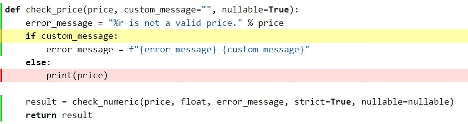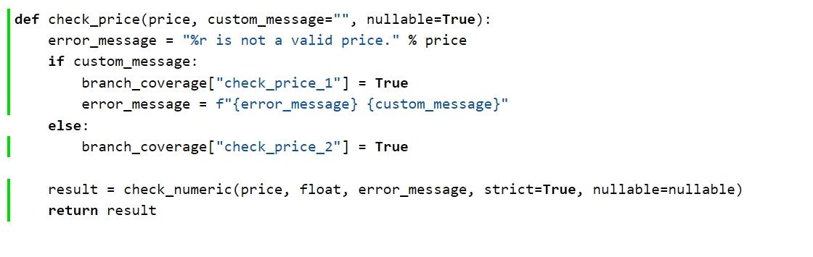

Newcoveragescreenshot:

Improvement:Old testsonlycovered 50%ofthebrancheswhileour added
testscover 100%ofthebranches.Thisputstheimprovementat2times.

Testfor check_numerical()

Commit:[<u>https://github.com/lobster-1/lumibotSEP/commit/857126cbb0c37c533571549cd0334375452f4f9c</u>](https://github.com/lobster-1/lumibotSEP/commit/857126cbb0c37c533571549cd0334375452f4f9c)

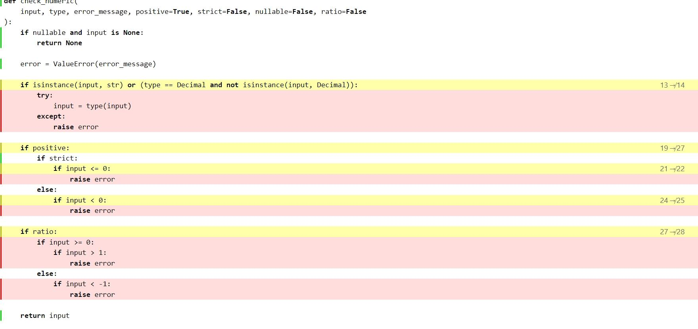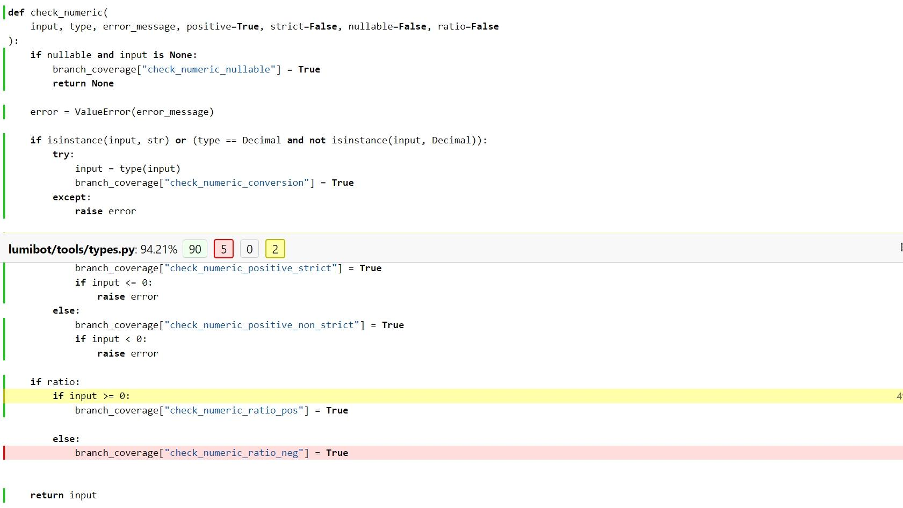

Old screenshot

:

Newscreenshot:

Improvement:

Wewereabletocover 5/6brancheswithour
newtestsputtingthenewcoverageat83.33. Compared toonly3/6branchescovered
withtheoriginaltests.Thisputstheimprovement at 1.66times

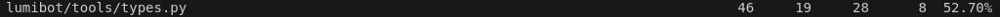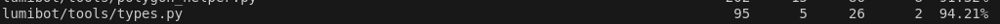

5\) Overall

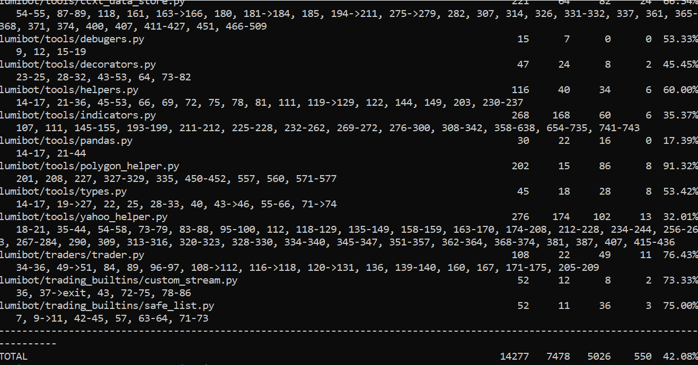Provide
a screenshot of the old coverage results by running an existing tool
(the same as you already showed above)

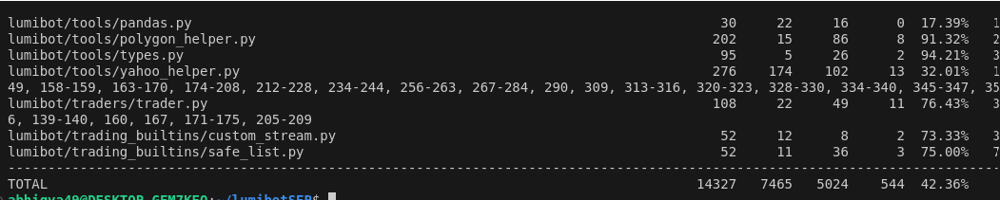Provide
a screenshot of the new coverage results by running the existing tool
using all test modifications made by the group

Improvement;

Itimproved
theoverallstatementcoveragefrom42.08%to42.36%acrossallthefilesand
moreimportantlyfrom 52.7%to94.21%for thefileinwhichour
functionswerechosen from

> Statement of individual contributions

Write what each group member did

Abhigya found the repository even though both Ishaan and Abhigya
searched for several ones before finding the chosen one. Ishaan counted
the lines of code via the Tokei tool. Abhigya analysed 2 functions and
wrote the tests for them and Ishaan also did the same for the other 2
functions. Abhigya did the coverage report and inital coverage while
Ishaan analysed the html to search for appropriate functions to analyze.

Overall it was a team effort by Ishaan and Abhigya as there were only 2
students working and 1 student was removed.
